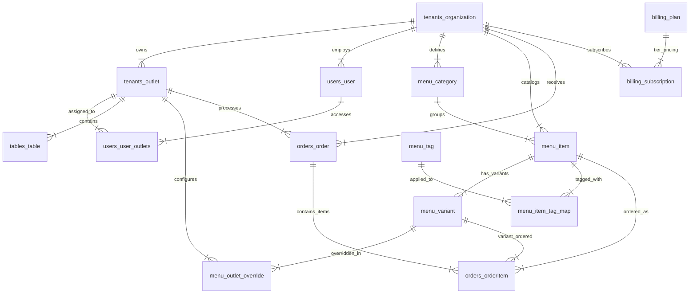

# PostgreSQL Database Schema & Entity Specification

> **Document Purpose:** Production-ready PostgreSQL 16 SQL DDL script, table definitions, relationships, integrity constraints, check rules, and performance indexing strategy.

---

## 1. Entity-Relationship Visual Overview (Mermaid)



---

## 2. PostgreSQL Production DDL Script

```sql
-- PostgreSQL Production DDL Schema
-- Extension for UUID generation
CREATE EXTENSION IF NOT EXISTS "uuid-ossp";

-- ==========================================
-- 1. TENANTS & OUTLETS
-- ==========================================

CREATE TABLE tenants_organization (
    id UUID PRIMARY KEY DEFAULT uuid_generate_v4(),
    name VARCHAR(150) NOT NULL,
    slug VARCHAR(150) UNIQUE NOT NULL,
    owner_name VARCHAR(100) NOT NULL,
    owner_email VARCHAR(254) UNIQUE NOT NULL,
    owner_mobile VARCHAR(15) UNIQUE NOT NULL,
    is_active BOOLEAN DEFAULT TRUE,
    created_at TIMESTAMP WITH TIME ZONE DEFAULT CURRENT_TIMESTAMP,
    updated_at TIMESTAMP WITH TIME ZONE DEFAULT CURRENT_TIMESTAMP
);

CREATE TABLE tenants_outlet (
    id UUID PRIMARY KEY DEFAULT uuid_generate_v4(),
    organization_id UUID NOT NULL REFERENCES tenants_organization(id) ON DELETE CASCADE,
    name VARCHAR(150) NOT NULL,
    slug VARCHAR(150) NOT NULL,
    address TEXT NOT NULL,
    city VARCHAR(100) NOT NULL DEFAULT 'Delhi / Mumbai / Bangalore / Lucknow',
    state VARCHAR(100) NOT NULL DEFAULT 'Uttar Pradesh',
    contact_number VARCHAR(15) NOT NULL,
    is_dine_in_enabled BOOLEAN DEFAULT TRUE,
    is_takeaway_enabled BOOLEAN DEFAULT TRUE,
    allow_table_editing BOOLEAN DEFAULT FALSE,
    opening_time TIME,
    closing_time TIME,
    created_at TIMESTAMP WITH TIME ZONE DEFAULT CURRENT_TIMESTAMP,
    CONSTRAINT unique_org_outlet_slug UNIQUE (organization_id, slug)
);

-- ==========================================
-- 2. USERS & ROLES
-- ==========================================

CREATE TABLE users_user (
    id UUID PRIMARY KEY DEFAULT uuid_generate_v4(),
    organization_id UUID REFERENCES tenants_organization(id) ON DELETE CASCADE,
    mobile VARCHAR(15) UNIQUE NOT NULL,
    email VARCHAR(254),
    full_name VARCHAR(100) NOT NULL,
    password_hash VARCHAR(255) NOT NULL,
    role VARCHAR(30) NOT NULL CHECK (role IN ('SUPER_ADMIN', 'OWNER', 'OUTLET_MANAGER', 'CASHIER', 'KITCHEN_STAFF', 'CUSTOMER')),
    is_staff BOOLEAN DEFAULT FALSE,
    is_active BOOLEAN DEFAULT TRUE,
    created_at TIMESTAMP WITH TIME ZONE DEFAULT CURRENT_TIMESTAMP
);

CREATE TABLE users_user_outlets (
    id SERIAL PRIMARY KEY,
    user_id UUID NOT NULL REFERENCES users_user(id) ON DELETE CASCADE,
    outlet_id UUID NOT NULL REFERENCES tenants_outlet(id) ON DELETE CASCADE,
    CONSTRAINT unique_user_outlet UNIQUE (user_id, outlet_id)
);

-- ==========================================
-- 3. MENU, CATEGORIES, TAGS & VARIANTS
-- ==========================================

CREATE TABLE menu_category (
    id UUID PRIMARY KEY DEFAULT uuid_generate_v4(),
    organization_id UUID NOT NULL REFERENCES tenants_organization(id) ON DELETE CASCADE,
    name VARCHAR(100) NOT NULL,
    description TEXT,
    display_order INT DEFAULT 0,
    is_active BOOLEAN DEFAULT TRUE,
    created_at TIMESTAMP WITH TIME ZONE DEFAULT CURRENT_TIMESTAMP,
    CONSTRAINT unique_org_category_name UNIQUE (organization_id, name)
);

CREATE TABLE menu_tag (
    id UUID PRIMARY KEY DEFAULT uuid_generate_v4(),
    organization_id UUID NOT NULL REFERENCES tenants_organization(id) ON DELETE CASCADE,
    name VARCHAR(50) NOT NULL, -- e.g., Veg, Non-Veg, Chef Special, Spicy, Jain, Bestseller
    color_code VARCHAR(10) DEFAULT '#16A34A',
    CONSTRAINT unique_org_tag_name UNIQUE (organization_id, name)
);

CREATE TABLE menu_item (
    id UUID PRIMARY KEY DEFAULT uuid_generate_v4(),
    organization_id UUID NOT NULL REFERENCES tenants_organization(id) ON DELETE CASCADE,
    category_id UUID NOT NULL REFERENCES menu_category(id) ON DELETE RESTRICT,
    name VARCHAR(150) NOT NULL,
    description TEXT,
    is_veg BOOLEAN DEFAULT TRUE,
    primary_image_url TEXT,
    is_active BOOLEAN DEFAULT TRUE,
    created_at TIMESTAMP WITH TIME ZONE DEFAULT CURRENT_TIMESTAMP
);

CREATE TABLE menu_item_tag_map (
    item_id UUID NOT NULL REFERENCES menu_item(id) ON DELETE CASCADE,
    tag_id UUID NOT NULL REFERENCES menu_tag(id) ON DELETE CASCADE,
    PRIMARY KEY (item_id, tag_id)
);

CREATE TABLE menu_variant (
    id UUID PRIMARY KEY DEFAULT uuid_generate_v4(),
    item_id UUID NOT NULL REFERENCES menu_item(id) ON DELETE CASCADE,
    variant_name VARCHAR(50) NOT NULL, -- e.g., Full, Half, 100g, 250g, 1kg
    unit_type VARCHAR(20) NOT NULL CHECK (unit_type IN ('full', 'half', 'quarter', 'piece', 'plate', 'bowl', 'glass', 'gram', 'kilogram', 'liter', 'ml')),
    unit_value NUMERIC(10, 2) DEFAULT 1.0, -- e.g., 250 for 250g
    base_price NUMERIC(10, 2) NOT NULL,
    is_default BOOLEAN DEFAULT FALSE,
    created_at TIMESTAMP WITH TIME ZONE DEFAULT CURRENT_TIMESTAMP
);

-- Store Overrides for Items / Variants
CREATE TABLE menu_outlet_override (
    id UUID PRIMARY KEY DEFAULT uuid_generate_v4(),
    outlet_id UUID NOT NULL REFERENCES tenants_outlet(id) ON DELETE CASCADE,
    variant_id UUID NOT NULL REFERENCES menu_variant(id) ON DELETE CASCADE,
    override_price NUMERIC(10, 2), -- NULL means use variant base_price
    is_available BOOLEAN DEFAULT TRUE,
    CONSTRAINT unique_outlet_variant UNIQUE (outlet_id, variant_id)
);

-- ==========================================
-- 4. TABLES & QR CODES
-- ==========================================

CREATE TABLE tables_table (
    id UUID PRIMARY KEY DEFAULT uuid_generate_v4(),
    outlet_id UUID NOT NULL REFERENCES tenants_outlet(id) ON DELETE CASCADE,
    table_number INT NOT NULL CHECK (table_number > 0), -- Numeric table number (e.g. 1, 2, 3). Displayed as T1, T2, T3... in UI
    capacity INT DEFAULT 4,
    is_active BOOLEAN DEFAULT TRUE,
    CONSTRAINT unique_outlet_table UNIQUE (outlet_id, table_number)
);

-- ==========================================
-- 5. ORDERS & TRANSACTIONS
-- ==========================================

CREATE TABLE orders_order (
    id UUID PRIMARY KEY DEFAULT uuid_generate_v4(),
    organization_id UUID NOT NULL REFERENCES tenants_organization(id) ON DELETE CASCADE,
    outlet_id UUID NOT NULL REFERENCES tenants_outlet(id) ON DELETE CASCADE,
    order_number VARCHAR(30) UNIQUE NOT NULL, -- e.g. ORD-20260813-001
    order_type VARCHAR(20) NOT NULL CHECK (order_type IN ('DINE_IN', 'TAKEAWAY', 'COUNTER')),
    table_number INT, -- Numeric table number (populated if DINE_IN; displayed as T1, T2...)
    
    -- Customer Information
    customer_mobile VARCHAR(15) NOT NULL,
    customer_name VARCHAR(100),
    
    -- Channel & Operational Metadata
    channel VARCHAR(20) DEFAULT 'QR_CODE' CHECK (channel IN ('QR_CODE', 'COUNTER_POS')),
    created_by_user_id UUID REFERENCES users_user(id), -- Cashier ID if created at POS
    
    -- Financial Totals
    subtotal NUMERIC(10, 2) NOT NULL,
    tax_amount NUMERIC(10, 2) DEFAULT 0.00,
    discount_amount NUMERIC(10, 2) DEFAULT 0.00,
    total_amount NUMERIC(10, 2) NOT NULL,
    payment_status VARCHAR(20) DEFAULT 'PENDING' CHECK (payment_status IN ('PENDING', 'PAID', 'REFUNDED')),
    payment_method VARCHAR(20) CHECK (payment_method IN ('CASH', 'UPI', 'CARD', 'PAY_LATER')),
    
    -- Order State Machine
    status VARCHAR(30) DEFAULT 'PLACED' CHECK (status IN ('PLACED', 'CONFIRMED', 'PREPARING', 'READY', 'DELIVERED', 'CANCELLED')),
    cancellation_reason TEXT,
    
    created_at TIMESTAMP WITH TIME ZONE DEFAULT CURRENT_TIMESTAMP,
    updated_at TIMESTAMP WITH TIME ZONE DEFAULT CURRENT_TIMESTAMP
);

CREATE TABLE orders_orderitem (
    id UUID PRIMARY KEY DEFAULT uuid_generate_v4(),
    order_id UUID NOT NULL REFERENCES orders_order(id) ON DELETE CASCADE,
    item_id UUID NOT NULL REFERENCES menu_item(id),
    variant_id UUID NOT NULL REFERENCES menu_variant(id),
    item_name VARCHAR(150) NOT NULL, -- Snapshot at time of order
    variant_name VARCHAR(50) NOT NULL, -- Snapshot at time of order
    unit_price NUMERIC(10, 2) NOT NULL,
    quantity INT NOT NULL CHECK (quantity > 0),
    total_price NUMERIC(10, 2) NOT NULL,
    special_instructions TEXT
);

-- ==========================================
-- 6. PRE-AGGREGATED ANALYTICS TABLES
-- ==========================================

CREATE TABLE analytics_daily_outlet_sales (
    id SERIAL PRIMARY KEY,
    date DATE NOT NULL,
    organization_id UUID NOT NULL REFERENCES tenants_organization(id) ON DELETE CASCADE,
    outlet_id UUID NOT NULL REFERENCES tenants_outlet(id) ON DELETE CASCADE,
    total_orders INT DEFAULT 0,
    total_revenue NUMERIC(12, 2) DEFAULT 0.00,
    dine_in_revenue NUMERIC(12, 2) DEFAULT 0.00,
    takeaway_revenue NUMERIC(12, 2) DEFAULT 0.00,
    cancelled_orders INT DEFAULT 0,
    CONSTRAINT unique_daily_outlet_sales UNIQUE (date, outlet_id)
);

CREATE TABLE analytics_daily_item_sales (
    id SERIAL PRIMARY KEY,
    date DATE NOT NULL,
    outlet_id UUID NOT NULL REFERENCES tenants_outlet(id) ON DELETE CASCADE,
    item_id UUID NOT NULL REFERENCES menu_item(id) ON DELETE CASCADE,
    variant_id UUID NOT NULL REFERENCES menu_variant(id) ON DELETE CASCADE,
    total_quantity_sold INT DEFAULT 0,
    total_revenue NUMERIC(12, 2) DEFAULT 0.00,
    CONSTRAINT unique_daily_item_sales UNIQUE (date, outlet_id, variant_id)
);

-- ==========================================
-- 7. SAAS SUBSCRIPTIONS & BILLING
-- ==========================================

CREATE TABLE billing_plan (
    id UUID PRIMARY KEY DEFAULT uuid_generate_v4(),
    name VARCHAR(50) NOT NULL, -- Starter, Growth, Scale, Pro, Enterprise
    monthly_price NUMERIC(10, 2) NOT NULL,
    max_outlets INT NOT NULL DEFAULT 1,
    max_orders_per_day INT NOT NULL DEFAULT 100,
    is_active BOOLEAN DEFAULT TRUE
);

CREATE TABLE billing_subscription (
    id UUID PRIMARY KEY DEFAULT uuid_generate_v4(),
    organization_id UUID NOT NULL REFERENCES tenants_organization(id) ON DELETE CASCADE,
    plan_id UUID NOT NULL REFERENCES billing_plan(id),
    status VARCHAR(20) DEFAULT 'ACTIVE' CHECK (status IN ('ACTIVE', 'EXPIRED', 'CANCELLED')),
    start_date DATE NOT NULL,
    end_date DATE,
    created_at TIMESTAMP WITH TIME ZONE DEFAULT CURRENT_TIMESTAMP
);

-- ==========================================
-- PERFORMANCE INDEXES
-- ==========================================

CREATE INDEX idx_orders_org_outlet_date ON orders_order (organization_id, outlet_id, created_at DESC);
CREATE INDEX idx_orders_status ON orders_order (outlet_id, status);
CREATE INDEX idx_orders_customer_mobile ON orders_order (customer_mobile);
CREATE INDEX idx_menu_item_org ON menu_item (organization_id, category_id);
CREATE INDEX idx_outlet_override_lookup ON menu_outlet_override (outlet_id, variant_id);
```
